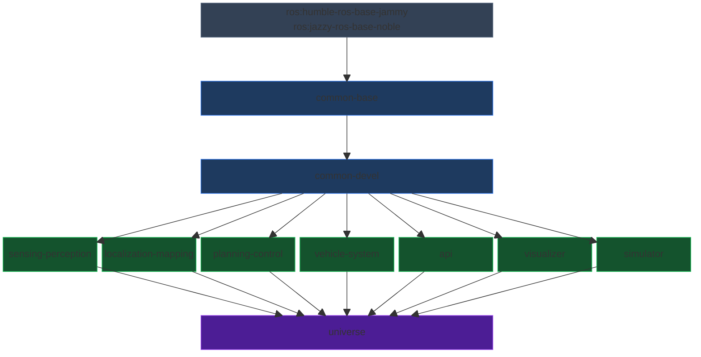

# Open AD Kit Components

[Open AD Kit](https://autoware.org/open-ad-kit/) offers containers for Autoware Components to simplify the deployment of Autoware and its dependencies. This directory contains scripts to build Component containers.

Detailed instructions on how to deploy the components can be found in the [Open AD Kit Deployments](https://autowarefoundation.github.io/openadkit/deployments/).

## Build Pipeline

### Build Groups

| Group | Description | Targets |
|-------|-------------|---------|
| `common` | Common images | base, devel |
| `component` | Component images | sensing-perception, sensing-perception-cuda, localization-mapping, planning-control, vehicle-system, api, visualizer, simulator |
| `universe` | Universe images | universe, universe-cuda |
