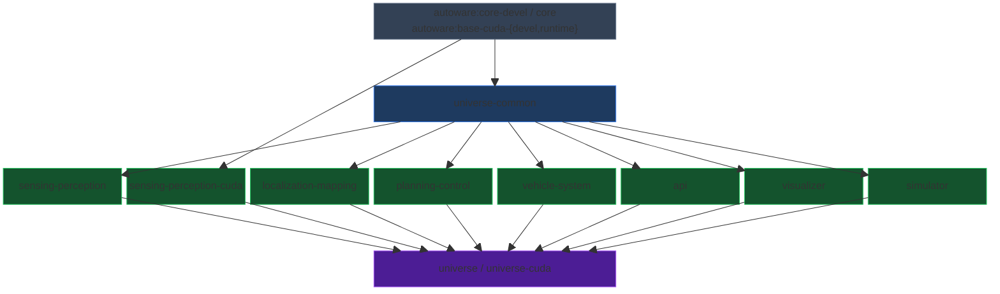

# Open AD Kit Components

[Open AD Kit](https://autoware.org/open-ad-kit/) offers containers for
Autoware Components to simplify the deployment of Autoware and its
dependencies. This directory holds the per-component Dockerfiles.

Detailed instructions on how to deploy the components can be found in the
[Open AD Kit Deployments](https://autowarefoundation.github.io/openadkit/deployments/).

## Build Pipeline

Images are built with `docker buildx bake` from
[`docker/docker-bake.hcl`](../docker/docker-bake.hcl). The `universe-common`
layer is an openadkit-owned thin intermediate that compiles the
universe-common slice of Autoware on top of upstream `core-devel`/`core`.

### Bake groups

| Group | Description | Targets |
|-------|-------------|---------|
| `universe-common` | Thin intermediate layer | `universe-common-devel`, `universe-common` |
| `components` | Non-CUDA component images | `sensing-perception`, `localization-mapping`, `planning-control`, `vehicle-system`, `api`, `visualizer`, `simulator` |
| `components-cuda` | CUDA component images | `sensing-perception-cuda` |
| `universe` / `universe-cuda` | Aggregated images | `universe`, `universe-cuda` |

See the [components documentation](https://autowarefoundation.github.io/openadkit/components/)
for build commands and the CI pipeline.
