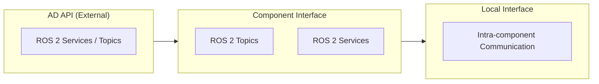

# Components

Open AD Kit is a component-based project designed to run on a variety of platforms with containerized services. Each **Autoware function** remains independently deployable, while the published images group closely related functions together to keep the runtime layout simpler.

## Architecture Overview

Autoware uses a **Core / Universe** architecture. **Core** contains rigorously reviewed base functionality required for safe autonomous driving. **Universe** contains community extensions and research features that build on the Core foundation. Open AD Kit packages Universe components into focused container images that can be composed into complete AD systems.

## Build Pipeline

--8<-- "includes/build-pipeline.md"

`universe-common` is an Open AD Kit-owned thin intermediate built on top of the
upstream `autoware:core-devel`/`base` images. The bake groups and build commands
are documented in [Build from Source](../development/build-from-source.md).

## Interface Layers

Autoware defines three formal interface categories that govern how components communicate:

<strong>AD API</strong>
External interface for fleet management and HMI. Exposed as ROS 2 services and topics for vehicle state queries and commands; external gateways (e.g. HTTP/MQTT) can be layered on top.

<strong>Component Interface</strong>
Internal inter-module communication via ROS 2 topics and services. Standardized message types ensure compatibility across components.

<strong>Local Interface</strong>
Intra-component communication within a single image. Implementation details that do not cross component boundaries.

## Autoware Components

Each Autoware function is packaged into a focused container image. Select a component from the sidebar or explore the pages below.

<strong><a href="sensing-perception/">Sensing &amp; Perception</a></strong>
Sensor preprocessing plus object detection, tracking, and multi-sensor fusion.

<strong><a href="localization-mapping/">Localization &amp; Mapping</a></strong>
HD map serving plus GNSS, IMU, visual odometry, and LiDAR map matching.

<strong><a href="planning-control/">Planning &amp; Control</a></strong>
Route, behavior, motion, and goal planning with PID/MPC trajectory tracking.

<strong><a href="vehicle-system/">Vehicle and System</a></strong>
Vehicle interface and system-level orchestration services.

<strong><a href="api/">API</a></strong>
AD API for external fleet management and HMI integration.

<strong><a href="simulator/">Simulator</a></strong>
Closed-loop simulation for validation and local development.

<strong><a href="visualizer/">Visualizer</a></strong>
Browser-accessible RViz2 via noVNC for remote monitoring.

<strong><a href="carla-interface/">CARLA Interface</a></strong>
Bridge for closed-loop simulation with the CARLA simulator.

## Image Reference

The published component images and their platforms. This table is generated from
the image catalog (`.github/image-inventory.json`), so it always matches what CI
builds. See [Container Images & Versioning](../getting-started/container-images.md) for the tag
naming scheme.

{{ component_table() }}

## Related

- [Deployments](../deployments/index.md) — How to compose components into running systems
- [Build from Source](../development/build-from-source.md) — Bake groups, CI pipeline, and upstream pin
- [Roadmap](../roadmap.md) — Release ladder and focus areas
- [Supported Platforms](../platforms/index.md) — Where to deploy
