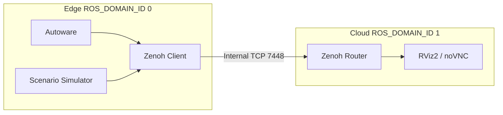

# Zenoh Bridge

Bridge an edge Autoware domain to a separate visualization and control domain
inside one Compose project. The edge runs Autoware and simulation; the cloud
side runs browser-based RViz2. Zenoh carries selected ROS 2 topics between the
isolated domains without publishing its transport port to the host.

## Architecture



The separate ROS domain IDs prevent native DDS cross-traffic. Configure topic
filters and namespaces in `config/zenoh-bridge-ros2dds.json5`.

## Setup

```bash
./openadkit setup --verify
./openadkit fetch scenario-simulation
cd deployments/zenoh-bridge
```

--8<-- "includes/docker-group-activation.md"

This standalone deployment requires a source checkout and is not included in
the unified release bundle or manifest-driven CLI. Override these in the
environment or `config.env` before invoking the helpers:

| Variable | Purpose | Default |
|----------|---------|---------|
| `MAP_PATH` | Kashiwanoha map directory | `$HOME/autoware_map/kashiwanoha_map` |
| `REMOTE_PASSWORD` | Required noVNC password | `openadkit` |

The deployment uses wall time and does not bridge `/clock`.

!!! note "Internal Zenoh transport"
    TCP 7448 has no authentication or encryption, so it remains inside the
    dedicated Compose network and is not published to the host.

## Run

### Full Project

```bash
./cloud.sh up -d
./edge.sh up -d
```

### Selected Groups

```bash
./cloud.sh up -d
./edge.sh up -d --no-sim
```

The edge helper starts Autoware, the edge bridge, and Scenario Simulator unless
`--no-sim` is selected. The cloud helper starts the cloud bridge and visualizer.

Open the visualizer at `https://localhost:6081/vnc.html` and use
`REMOTE_PASSWORD`.

## Teleoperation

```bash
./cloud.sh up -d --with-teleop
./edge.sh up -d
./run_teleop.sh
```

Use `./edge.sh up -d --no-sim` to run Autoware without the scenario simulator.

| Key | Action |
|-----|--------|
| `W` / `S` | Throttle / brake |
| `A` / `D` | Steer |
| `Z` | Toggle auto/local control |
| `X` / `C` / `V` | Drive / reverse / park |
| `M` | Cycle drive mode |
| `R` | Reset to the configured initial pose |
| `Space` | Emergency stop or resume |
| `Q` | Quit |

For a fresh `--no-sim` session, press `R` to initialize the pose, `Z` to enter
local control, choose a gear with `X` or `C`, select the drive mode with `M`,
then use the movement keys.

## Stop and Troubleshoot

```bash
./cloud.sh ps
./edge.sh ps
./cloud.sh logs
./edge.sh logs
./edge.sh down
./cloud.sh down
```

If a bridge is not ready, inspect the helper logs. Host port **6081** must be
free; Zenoh ports **7447** and **7448** stay inside the Compose networks.
Re-fetch the map from the repository root with
`./openadkit fetch scenario-simulation --force`.

The `autoware` service uses the digest-pinned upstream image declared directly
in `docker-compose.yaml`.
