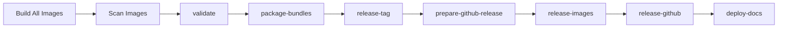

# Build from Source

This guide covers building Open AD Kit container images locally from the repository source.

!!! note "Who needs this"
    Building from source is for **maintainers and contributors**. Typical users should pull the pre-built images from GHCR — see [Container Images & Versioning](../getting-started/container-images.md).

## Prerequisites

- Docker Engine with [Buildx](https://docs.docker.com/build/architecture/#buildx) (bundled with current Docker Engine)
- Git (to clone this repository)
- `pipx` and `vcs2l` (to import the Autoware source tree used by component Dockerfiles)
- Sufficient disk space — the full build set is large (multiple multi-gigabyte images)

Open AD Kit builds on top of upstream Autoware base images published on GHCR, but
the component Dockerfiles still bind-mount a local `autoware/src` tree to compile
their scoped package sets. Prepare that tree before running Bake.

## Build System

Images are built with [Docker Bake](https://docs.docker.com/build/bake/). All targets are defined in [`components/docker-bake.hcl`](https://github.com/autowarefoundation/openadkit/blob/main/components/docker-bake.hcl), which is also the file CI uses (`build-all-images.yaml`).

The build is staged: the `universe-common` intermediate builds on top of the upstream Autoware images, and the component images build *from* `universe-common`.

--8<-- "includes/build-pipeline.md"

`universe-common` is an Open AD Kit-owned thin intermediate that compiles only the
universe-common slice of Autoware on upstream `core-devel`. Its runtime stage uses
the lean upstream `base` image and copies in the compiled core/common install tree,
so development files from `core-devel` do not enter published runtime layers.
`sensing-perception-cuda` is a parallel CUDA branch that inherits from the
upstream `base-cuda-{devel,runtime}` images and grafts in the `universe-common`
install tree.

### Build Groups

| Group | Targets | Published To |
|-------|---------|--------------|
| `universe-common` | `universe-common-devel`, `universe-common` | `ghcr.io/autowarefoundation/openadkit-common` |
| `component` | `sensing-perception`, `localization-mapping`, `planning-control`, `vehicle-system`, `api`, `visualizer`, `simulator`, `sensing-perception-cuda`, `carla-interface` | `ghcr.io/autowarefoundation/openadkit` |
| `default` | everything: `universe-common` + `component` | — |

`carla-interface` is an **amd64-only** member of the `component` group, built on top of the `simulator` image and published as `ghcr.io/autowarefoundation/openadkit:carla-interface`.

## Building

### End-to-End Workflow

The following steps take you from a fresh clone to a running deployment using
locally built images.

```bash
# 1. Clone the repository
git clone https://github.com/autowarefoundation/openadkit.git
cd openadkit

# 2. Install host dependencies
./openadkit setup --verify
```

--8<-- "includes/docker-group-activation.md"

```bash
# 3. Make the pipx-installed vcs command available in this shell
export PATH="$HOME/.local/bin:$PATH"

# 4. Import Autoware sources at the release used by upstream base images
AUTOWARE_REF=1.8.0
export UPSTREAM_TAG="$AUTOWARE_REF"
git clone --branch "$AUTOWARE_REF" --depth 1 \
  https://github.com/autowarefoundation/autoware.git
mkdir -p autoware/src
vcs import --shallow autoware/src < autoware/repositories/autoware.repos
mkdir -p autoware/src/middleware/external
touch autoware/src/middleware/external/.keep

# 5. Build the universe-common base intermediate (~2 hours)
docker buildx bake -f components/docker-bake.hcl universe-common

# 6. Build and tag the planning-simulation images (~2 hours)
ARCH=$(uname -m)
case "$ARCH" in
  x86_64|amd64) ARCH=amd64 ;;
  aarch64|arm64) ARCH=arm64 ;;
esac
docker buildx bake -f components/docker-bake.hcl \
  --set localization-mapping.tags=ghcr.io/autowarefoundation/openadkit:localization-mapping-${ARCH}-humble \
  --set planning-control.tags=ghcr.io/autowarefoundation/openadkit:planning-control-${ARCH}-humble \
  --set vehicle-system.tags=ghcr.io/autowarefoundation/openadkit:vehicle-system-${ARCH}-humble \
  --set api.tags=ghcr.io/autowarefoundation/openadkit:api-${ARCH}-humble \
  --set visualizer.tags=ghcr.io/autowarefoundation/openadkit:visualizer-${ARCH}-humble \
  --set simulator.tags=ghcr.io/autowarefoundation/openadkit:simulator-${ARCH}-humble \
  --load \
  planning

# 7. Override image tags as needed, then start a deployment
./openadkit run planning-simulation
```

The `--load` flag makes images available in the local Docker store (without it,
Bake only populates the BuildKit cache). Repository-mode `./openadkit` injects
`<prefix>:<target>-<arch>-<ros-distro>` (for example
`planning-control-amd64-humble`). Local tags must match that name, or set the
`*_IMAGE` variables in `config.local.env`. For Jazzy, build with
`ROS_DISTRO=jazzy` and use `-jazzy` suffixes. Group `planning` matches this
walkthrough on amd64 and arm64. Group `component` also builds
`carla-interface` and `sensing-perception-cuda`, which are amd64-only.

### Build Targets (Reference)

To build only specific targets or groups, pass the group or target name as an
argument to Bake. Local builds resolve cross-stage references within a single
Bake graph.

```bash
# Build everything (universe-common + all components)
docker buildx bake -f components/docker-bake.hcl

# Build only the universe-common intermediate
docker buildx bake -f components/docker-bake.hcl universe-common

# Build the component group
docker buildx bake -f components/docker-bake.hcl component

# Build a single component
docker buildx bake -f components/docker-bake.hcl \
  --set sensing-perception.tags=openadkit:sensing-perception \
  --load \
  sensing-perception
```

### Build Variables

The Bake file exposes a few variables, overridable via environment variables:

| Variable | Description | Default |
|----------|-------------|---------|
| `ROS_DISTRO` | `humble` or `jazzy` | `humble` |
| `UPSTREAM_TAG` | Pins the upstream Autoware release (e.g. `1.8.0`). Empty pulls the plain `<name>-<distro>` multi-arch tag — handy for local experiments, not for reproducible builds. | `""` |
| `UPSTREAM_REPO` | Upstream Autoware image repository | `ghcr.io/autowarefoundation/autoware` |

```bash
# Reuse the ref selected for the Autoware checkout above
ROS_DISTRO=humble UPSTREAM_TAG="$AUTOWARE_REF" \
  docker buildx bake -f components/docker-bake.hcl component
```

!!! note "Tags and contexts"
    The `docker-bake.hcl` targets carry no tag or context defaults — image tags are injected by `docker/metadata-action` in CI, and you supply them locally with `--set <target>.tags=...`. Cross-stage references (`universe-common` ← components) resolve via `target:` within one local build graph; CI instead overrides each context to an already-pushed GHCR tag so groups can build in separate jobs.

## Continuous Integration

CI builds every target automatically via [`.github/workflows/build-all-images.yaml`](https://github.com/autowarefoundation/openadkit/blob/main/.github/workflows/build-all-images.yaml), which invokes the same Bake file across a build matrix. The matrix (targets, platforms, ROS distros) is driven by [`.github/image-inventory.json`](https://github.com/autowarefoundation/openadkit/blob/main/.github/image-inventory.json) — the source of truth for what gets built and on which architectures.

The workflow runs staged jobs — `prepare`, then `build-common` and `build-components`, then `build-carla-interface` (which depends on `simulator`) — so each layer is pushed before the layer that depends on it. Most targets build for `{humble, jazzy} × {amd64, arm64}`; `sensing-perception-cuda` and `carla-interface` are amd64-only (Humble and Jazzy). A final `create-manifests` job stitches the per-arch tags into multi-arch manifests.

If a scheduled build fails, a `notify-failure` job creates a GitHub issue with the run URL so maintainers are notified without polling the Actions tab. Failure notifications are only created for scheduled builds, not for push or manual triggers.

## Release Process

Open AD Kit releases are promoted from existing CI builds rather than rebuilt at release time. This ensures that the exact images validated during CI are the images that ship to users.

### Before You Release

Before running the release pipeline, verify:

- **`vars.UPSTREAM_TAG`** is set in the repository or organization Variables on GitHub. This selects the default Autoware source release (e.g. `1.8.0`). Manual `autoware_ref` inputs override it; the workflow derives and pins the matching base-image release from the resolved source ref.
- **GHCR packages** are accessible: `ghcr.io/autowarefoundation/openadkit`, `ghcr.io/autowarefoundation/openadkit-common`, and the build cache repo `ghcr.io/autowarefoundation/openadkit-buildcache` must accept pushes from CI.
- **`secrets.RELEASE_TOKEN`** is available when promoting a build commit older than subsequent workflow changes. Use a token with repository Contents and Workflows write access; otherwise the workflow uses `GITHUB_TOKEN`.
- **A successful build** exists: `build-all-images` completed on `main` from an exact Autoware release tag or full SHA. Stable releases require a tag; SHA builds can only be promoted to pre-releases. Branch builds cannot be promoted. The build summary shows the resulting `build_tag`.
- **A successful scan** exists: `scan-images` completed and **passed** for that `build_tag`.

### Workflow Steps

The release workflow (`.github/workflows/release.yaml`) has seven jobs that run sequentially:

1. **validate** — Downloads build metadata and scan results, then runs 14 validation gates before any images are tagged.
2. **package-bundles** — Generates the immutable release plan and packages the
   unified Humble/Jazzy runtime bundle before any release state is published.
3. **release-tag** — Creates or verifies the Git tag, failing closed on API errors or a conflicting commit.
4. **prepare-github-release** — Creates a workflow-owned draft, or verifies an existing published release against the complete metadata, notes, target SHA, and assets.
5. **release-images** — Promotes immutable image tags, rechecks the latest-stable policy, then updates mutable aliases only if the policy is unchanged.
6. **release-github** — Revalidates the exact draft release ID and publishes it after image promotion succeeds.
7. **deploy-docs** — Publishes documentation from the release workflow revision on `main` when the release updates stable aliases.



Prerequisite CI (`build-all-images` + passing `scan-images`) runs before the
release workflow. The seven release jobs then run in the order above.

#### Validation Gates

Before any image is tagged, the `validate` job (`.github/scripts/validate_release.sh`) checks:

| # | Gate | What it verifies |
|---|------|------------------|
| 1 | **Version format** | `vX.Y.Z` for stable, `vX.Y.Z-prerelease` for pre-release |
| 2 | **Build tag format** | Must match `RUN_ID-RUN_ATTEMPT` |
| 3 | **Source branch** | Release must run from `main` |
| 4 | **Manifest consistency** | `default_ros_distro` and the component image prefix must match `openadkit.json` |
| 5 | **Alias policy** | If a newer stable release already exists, latest aliases won't be updated |
| 6 | **Build provenance** | The build tag must reference a completed, successful `build-all-images` run on `main` |
| 7 | **Build age** | Build must be less than 90 days old |
| 8 | **Scan results** | A passing `scan-images` run must exist for the build; scan metadata is validated against the build metadata |
| 9 | **Metadata schema** | 15+ fields in `build-metadata.json` are validated (types, formats, SHA256 lengths) |
| 10 | **File integrity** | SHA256 of `autoware-lock.repos`, `image-inventory.json`, and `upstream-images.json` must match the metadata |
| 11 | **Autoware revision** | Stable releases require an exact Autoware release tag matching the base version; pre-releases also accept a full SHA |
| 12 | **Inventory coverage** | Every image in `image-inventory.json` must be present in the build; no missing or extra images |
| 13 | **Upstream coverage** | Every required Autoware base is recorded and consumed as an immutable manifest digest |
| 14 | **Scan coverage** | Every image digest and platform must have a scan result |
| 15 | **Registry integrity** | Build images must still exist in GHCR with matching digests; confirmed missing tags are distinguished from retried transient and fail-closed registry errors |

If all 15 gates pass, the workflow proceeds to tag promotion.

#### Tag Promotion

The `release-images` job iterates over every image in the build metadata and creates release tags directly from the promoted digest:

- Stable release tag: `<repo>:<target>-<distro>-v<version>`
- Per-distro alias: `<repo>:<target>-<distro>` (stable releases only)
- Per-distro latest: `<repo>:<target>-<distro>-latest`
- Default alias: `<repo>:<target>` (only for the default ROS distro)
- Default latest: `<repo>:<target>-latest`

Each alias is created independently from the digest — there is no sequential retagging.

#### GitHub Release

- **`prepare-github-release`** creates a workflow-owned draft (or verifies an
  existing published release) with notes, provenance, the immutable release
  plan, and one unified dual-distro runtime bundle.
- **`release-github`** revalidates that draft and publishes it only after
  `release-images` succeeds.

The resulting tag aliases are documented in [How Releases Are Tagged](../getting-started/container-images.md#how-releases-are-tagged).

### Source of Truth

The following artifacts are the canonical reference for release validation:

- **Build metadata** — CI run logs and artifact manifests
- **`upstream-images.json`** — Exact Autoware base manifests consumed by the build
- **Scan metadata** — CVE scan results
- **`.github/image-inventory.json`** — Canonical inventory of all published images and their tags
- **`release-plan.json`** — Immutable release refs, aliases, asset inventory,
  deployment checksums, and dual-distro runtime context

## Related

- [Contributing](contributing.md) — How to submit your changes
- [Components](../components/index.md) — What each image contains
- [Container Images & Versioning](../getting-started/container-images.md) — Pulling pre-built images
