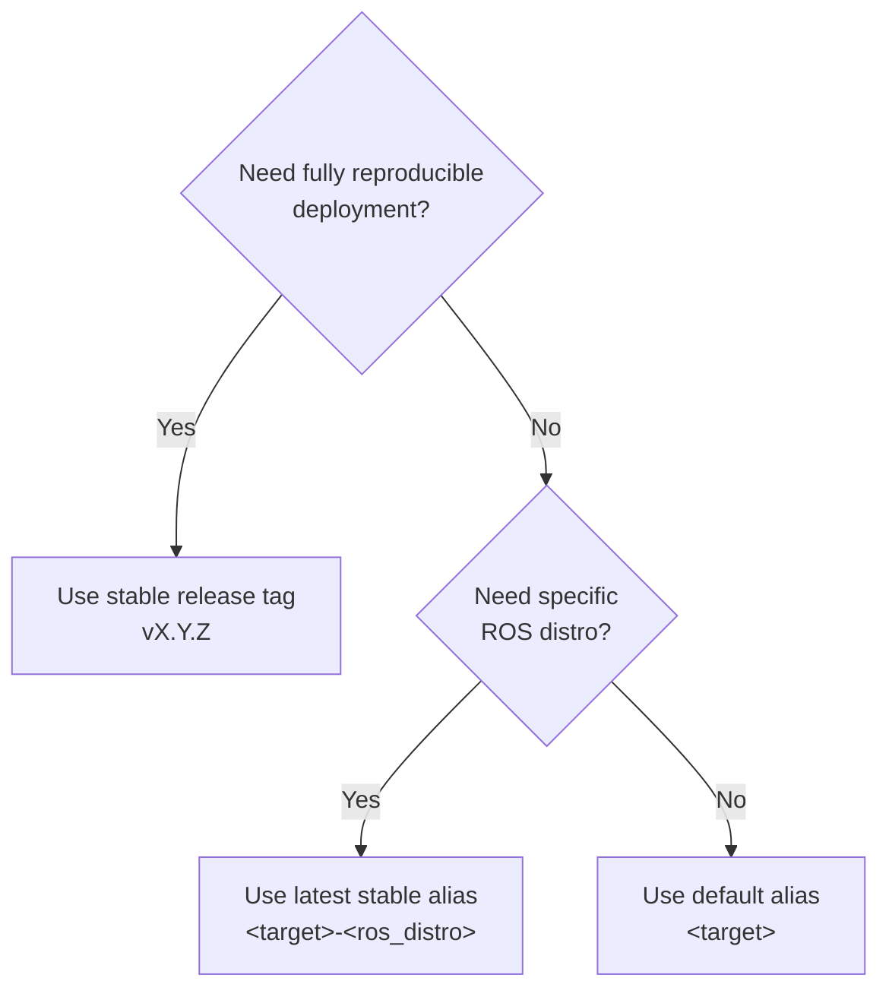

# Container Images & Versioning

Open AD Kit publishes images to the GitHub Container Registry (`{{ registry }}`). This page is the canonical reference for the tag schema, the version scheme, and what "supported" means.

## Tag Reference

| Tag Pattern | Example | Description |
|-------------|---------|-------------|
| **Stable release** | `planning-control-humble-v2.0.0` | Immutable release tag. Use this when you need a fully reproducible deployment. |
| **Latest stable alias** | `planning-control-humble` | Always resolves to the latest stable release for the specified ROS distro. |
| **Latest stable + suffix** | `planning-control-humble-latest` | Same as above, explicit. |
| **Default ROS distro alias** | `planning-control` | Convenience alias that resolves to the current default ROS distro ({{ default_distro_title }}). |
| **Default + latest suffix** | `planning-control-latest` | Explicit default-distro latest alias. |
| **Immutable build tag** | `planning-control-humble-123456789-1` | Pin to a specific CI build. Format: `<target>-<ros_distro>-<run_id>-<run_attempt>`. Per-platform variants include the platform label (e.g. `planning-control-amd64-humble-123456789-1`), but prefer the multi-arch tag for portability. |
| **CI development alias** | `planning-control-amd64-humble` | Per-platform mutable tag used during CI. **Do not use for pinned deployments.** |
| **Pre-release** | `planning-control-humble-v2.0.0-rc.1` | Pre-release tag for testing. Pre-releases do not update latest stable aliases. |

!!! note "ROS 2 distributions"
    Examples use **{{ default_distro_title }}** (the current default). **Jazzy** images are published in parallel for most components — substitute `-jazzy` for `-humble` in tags (e.g. `planning-control-jazzy`, `planning-control-jazzy-v2.0.0`). `carla-interface` is amd64-only for Humble and Jazzy; the CARLA *deployment* is Humble-only.

## CUDA Images

CUDA-enabled variants follow the same patterns but are **amd64-only**:

| Tag Pattern | Example |
|-------------|---------|
| Stable release | `sensing-perception-cuda-humble-v2.0.0` |
| Latest alias | `sensing-perception-cuda-humble` |

## Choosing a Tag

**Production / reproducible deployments** — Use a stable release tag (`vX.Y.Z`).

**Development / latest features** — Use a latest stable alias (`<target>-<ros_distro>`).

**Quick start / deployments** — Use a default ROS distro alias (`<target>`).

**Never pin to CI development aliases** (`*-amd64-*`) — Do not use mutable per-platform tags in committed deployment files.

### Decision Flow

## Versioning

Open AD Kit releases use [Semantic Versioning](https://semver.org/): `vMAJOR.MINOR.PATCH` (for example, `v2.0.0`).

| Component | Increments when |
|-----------|-----------------|
| **MAJOR** | A backward-incompatible change to the public deployment surface — image taxonomy, documented compose/deployment layout, or removal of a supported platform/variant. |
| **MINOR** | New backward-compatible capability — additional components, platforms, deployments, or CI/release machinery. |
| **PATCH** | Backward-compatible fixes — bug fixes, security/CVE remediation, image refreshes, and documentation corrections within the same release surface. |

The Open AD Kit version is **independent of the Autoware version** it packages: a single Open AD Kit release pins a specific upstream Autoware release (see below), and a new Autoware release does not automatically change the Open AD Kit version.

## Relationship to Autoware

Each Open AD Kit release pins a specific upstream **Autoware semver meta-release** and records it in the release:

- Stable Open AD Kit releases pin an Autoware `X.Y.Z` meta-release tag.
Each release records its pinned Autoware version in the release notes.

A release pins, at minimum: the Open AD Kit version, the Autoware meta-release, the ROS 2 distro(s), and the published image tags and digests. Published release details are listed on the [Releases](../releases/index.md) page; how the tags are structured is in the [Tag Reference](#tag-reference) above.

## ROS 2 Distro Support

| Distro | Status at v2.0 |
|--------|----------------|
| **Humble** | Default, documented path. |
| **Jazzy** | Built and published **in parallel** wherever the `amd64`+`arm64` matrix is green. |

Each release bundle carries digest-pinned Humble and Jazzy component maps and
selects one at runtime with `--ros-distro`. Humble remains the default. Distro
support tracks the upstream ROS 2 lifecycle; a distro is supported by Open AD
Kit only while it is supported upstream.

## What "Supported" Means

- **Releases** — The latest stable release is supported. Fixes (including security/CVE remediation) land in a new patch or minor release rather than being backported to older tags. Stable release tags are immutable; see [Choosing a Tag](#choosing-a-tag) for pinning guidance.
- **Platforms** — Support is tiered (committed / experimental / best-effort / unsupported). A variant that does not pass its build/validation gate is dropped from the support matrix rather than shipped as if it worked. See [Supported Platforms](../platforms/index.md) for the current, honest matrix.
- **No certification claims** — "Supported" refers to build, deployment, and validation in a non-certified environment. Open AD Kit makes no safety-certification, functional-safety, or production-readiness claims.

## How Releases Are Tagged

Releases are promoted from existing CI builds rather than rebuilt at release time, so the exact images validated during CI are the images that ship. When a release workflow runs, each tag alias is created independently from the promoted image digest:

| Alias | Example | Condition |
|-------|---------|-----------|
| Stable release | `planning-control-humble-v2.0.0` | Always created |
| Latest per-distro | `planning-control-humble` | Stable releases only |
| Latest per-distro + suffix | `planning-control-humble-latest` | Stable releases only |
| Default distro alias | `planning-control` | Stable releases, only for the default ROS distro |
| Default distro + suffix | `planning-control-latest` | Stable releases, only for the default ROS distro |

!!! info "Pre-Releases"
    Pre-release tags (e.g., `-rc.1`) are published but **do not update** latest stable aliases. This prevents prerelease images from being pulled by default aliases.

Maintainer workflow steps are documented in the [Release Process](../development/build-from-source.md#release-process).

## Related

- [Quickstart](index.md) — Environment setup and first deployment
- [Releases](../releases/index.md) — Published release details
- [Build from Source](../development/build-from-source.md) — Building images locally
- [Troubleshooting](troubleshooting.md) — Common issues
