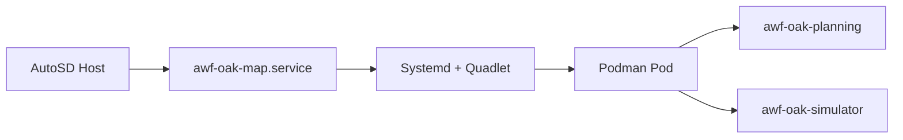

# AutoSD + Planning + Simulator

!!! abstract ""
    This deployment demonstrates how to run and validate Autoware planning and simulation workflows inside AutoSD using systemd-managed containers (Quadlet) and Podman.

## Repository Location

Runnable assets live under [`platforms/autosd/planning-simulator/`](https://github.com/autowarefoundation/openadkit/tree/main/platforms/autosd/planning-simulator) in the Open AD Kit repository.

| Folder | Contents |
|--------|----------|
| `aib/` | Automotive Image Builder manifest files (`image.aib.yml`, `vars.yml`) to build an AutoSD OS image |
| `components/container-files/` | Quadlet unit files for Podman containers, the shared pod, and the shared environment file (`awf-oak.env`) |
| `components/systemd/` | systemd oneshot service for map extraction |
| `components/scripts/` | Helper scripts installed into the AutoSD image |

!!! note "Images used by this demo"
    `aib/image.aib.yml` pulls pinned upstream images, not modular Open AD Kit
    component tags:

    - `ghcr.io/autowarefoundation/autoware:universe-0.45.1-amd64`
    - `ghcr.io/tier4/scenario_simulator_v2:humble-25.0.20-runtime`

    For the modular Docker Compose stack with browser RViz2, use
    [Planning Simulation](../../../deployments/planning-simulation/index.md).

## Prerequisites

Before using this deployment, build and boot an AutoSD image following the [AutoSD Platform Overview](../index.md) guide. You need:

- Docker or Podman and QEMU (for the containerized image builder workflow)
- An RPM-based host if running Automotive Image Builder directly on the host

## Quadlet Services

After boot, systemd starts the following services defined under `components/`:

| Service | Type | Description |
|---------|------|-------------|
| `awf-oak-map.service` | Oneshot | Extracts the bundled Kashiwanoha map to `/opt/tier4/kashiwanoha_map` |
| `awf-oak-planning.container` | Container | Runs the Autoware planning stack with scenario simulation enabled |
| `awf-oak-simulator.container` | Container (oneshot) | Runs the TIER IV Scenario Simulator once against the bundled `sample.yaml` scenario, then exits |
| `awf-oak.pod` | Pod | Shared Podman pod for co-located planning and simulator containers |

!!! note "Unit naming"
    Quadlet `.container` files register with systemd as `.service` units. The table lists the source unit files (`awf-oak-planning.container`); when querying them with `systemctl`, use the generated service name (`awf-oak-planning.service`). Both names refer to the same unit.

The planning container launches `planning_simulator.launch.xml` with the extracted map mounted at `/etc/awf/map` and RViz disabled (`rviz:=false`). The simulator container runs `scenario_test_runner` against the bundled `sample.yaml` scenario. The simulator is a `Type=oneshot` service — it runs the scenario once (up to ~180 seconds) and then exits. After completion, `systemctl status awf-oak-simulator.service` shows `inactive (dead)`, which is expected, not a failure. The planning container stays running.

Both containers source `awf-oak.env`, which sets `ROS_DOMAIN_ID=26` and `RMW_IMPLEMENTATION=rmw_cyclonedds_cpp`. Use these values when running additional ROS 2 nodes alongside the deployment.

## Workflow

1. Build an AutoSD image with the Automotive Image Builder using the manifests in `aib/` (see [AutoSD build instructions](../index.md#building-an-autosd-image))
2. Boot the image on QEMU or target hardware
3. Confirm the Quadlet services are active:

   ```bash
   systemctl status awf-oak-map.service
   systemctl status awf-oak-planning.service
   systemctl status awf-oak-simulator.service
   ```

4. Verify the planning and simulator services are running and observe logs:

   ```bash
   journalctl -u awf-oak-planning.service -f
   journalctl -u awf-oak-simulator.service -f
   ```



## Expected Outcome

Once all services are running, you can:

- Observe the Autoware planning stack responding to the scenario simulator environment via service logs
- Validate the AutoSD + Podman + Quadlet deployment path before moving to vehicle hardware

For a Docker Compose equivalent with a browser-accessible RViz2 visualizer, see the [Planning Simulation deployment](../../../deployments/planning-simulation/index.md).

## Related

- [AutoSD Platform Overview](../index.md)
- [Planning Simulation deployment](../../../deployments/planning-simulation/index.md)
- [Open AD Kit Deployments](../../../deployments/index.md)
- [Components Overview](../../../components/index.md)
