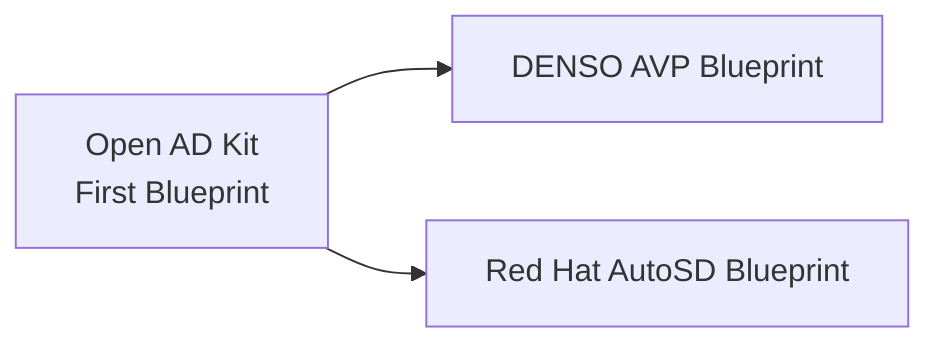

# Supported Platforms

[**Deployments**](../deployments/index.md) provide local development and simulation on Ubuntu using Docker Compose.
**Platforms** provide edge-deployment targets for production automotive operating systems such as AutoSD.

As Open AD Kit is the first [SOAFEE](https://www.soafee.io/) blueprint for the software-defined vehicle ecosystem, it tracks multiple platform directions aligned with cloud-native, software-defined vehicle principles.

!!! abstract "SOAFEE and Open AD Kit"
    The Autoware Foundation is a voting member of [SOAFEE](https://www.soafee.io/) (Scalable Open Architecture For the Embedded Edge). Open AD Kit was co-developed with SOAFEE and the [eSync Alliance](https://esyncalliance.org/) as the first blueprint, and has since seeded derived blueprints including DENSO's AVP blueprint and Red Hat's AutoSD blueprint.

    Read more about the [benefits of open standards in automotive development](https://www.soafee.io/blog/2025/the-benefits-of-open-standards-in-automotive-development/).

## Platform Overview

:material-server:{ .oak-card-icon }

<h3>AutoSD</h3>

Automotive Stream Distribution — the upstream preview of Red Hat In-Vehicle OS. Mixed-criticality containers with Podman, Quadlet, and BlueChi orchestration.

<a href="autosd/" class="md-button md-button--primary">View AutoSD Docs</a>

:material-cloud-outline:{ .oak-card-icon }

<h3>EWAOL</h3>

Edge Workload Abstraction and Orchestration Layer — Arm's container-centric Yocto framework. Upstream SOAFEE reference, retained as background; not a committed Open AD Kit target.

<a href="ewaol/" class="md-button">View EWAOL Docs</a>

## Development Platforms

For local development and simulation, Open AD Kit supports:

- **Ubuntu 22.04 LTS** (primary)
- **Ubuntu 24.04 LTS**

## Support matrix

Tiers describe how seriously Open AD Kit treats a host or platform path. A path
that does not pass its build or validation gate is dropped or marked below
rather than documented as if it worked. Hardware-specific rows use the badges on
the [hardware page](hardware/index.md).

| Path | Tier | Notes |
|------|------|-------|
| Ubuntu 22.04 + Docker Compose deployments | **Committed** | Primary documented path; compose validated in CI |
| Ubuntu 24.04 + Docker Compose deployments | **Committed** | Supported host; some demos (e.g. CARLA 0.9.16) stay on 22.04 |
| Component images amd64 + arm64 (non-CUDA) | **Committed** | Published per [image inventory](https://github.com/autowarefoundation/openadkit/blob/main/.github/image-inventory.json) |
| `sensing-perception-cuda` | **Committed** (amd64 only) | Requires NVIDIA Container Toolkit |
| `carla-interface` / CARLA deployment | **Experimental** | Image is amd64 Humble and Jazzy; the deployment is Humble + Ubuntu 22.04 only |
| AutoSD planning-simulator assets | **Experimental** | Platform demo with upstream Autoware images; not modular OAK components |
| Jazzy multi-arch matrix (where green) | **Best-effort** until sustained green promotion | Built in parallel; Humble remains the default documented path |
| EWAOL | **Unsupported** | Upstream SOAFEE background only; no in-repo assets |
| Hardware (ADLINK, AWS G5, Jetson, …) | See [Hardware](hardware/index.md) | Verified / Tests Ongoing badges; not a substitute for the tiers above |

## Related

- [Hardware requirements and tested platforms](hardware/index.md)
- [Getting started guide](../getting-started/index.md)
- [Container Images & Versioning](../getting-started/container-images.md)
