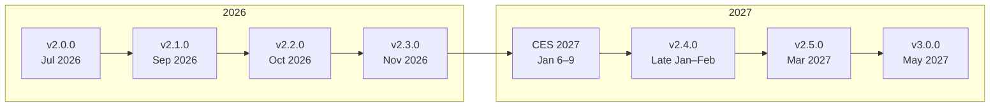

# Roadmap

Open AD Kit matures in stages. We start with a trustworthy foundation and layer on validation, security, and automation until the full pipeline is proven end to end.

## Release Ladder

| Release | Target | Scope |
| :--- | :--- | :--- |
| **v2.0.0** | Jul 2026 | **Trustworthy release** Pinned images, scans, bundles, compose validation, CARLA 0.9.16 |
| **v2.1.0** | Sep 2026 | **Compatibility MVP** Lockfiles, manifests, validation, platform matrix |
| **v2.2.0** | Oct 2026 | **Readiness + gating** Scenario V2 CI gate, health readiness, restart path |
| **v2.3.0** | Nov 2026 | **Trust signals** SBOM, provenance, cosign signing, vulnerability policy |
| **CES 2027** | Jan 6–9 | **Flagship demo** VisionPilot + Safety Island + CARLA (event, not a release gate) |
| **v2.4.0** | Late Jan–Feb | **Platform profiles** Production AutoSD/Podman profiles (OAK component images, BlueChi); Zenoh split; S-Core analysis. An experimental AutoSD planning-simulator demo already exists under `platforms/autosd/`. |
| **v2.5.0** | Mar 2027 | **Update/rollback beta** Staged apply, health promotion, verified rollback |
| **v3.0.0** | May 2027 | **Closed loop** Build → deploy → test → observe → update → rollback |

## Related

- [Getting Started](getting-started/index.md) — Set up your environment
- [Development](development/index.md) — Build from source and contribute
- [Releases](releases/index.md) — Current release status
