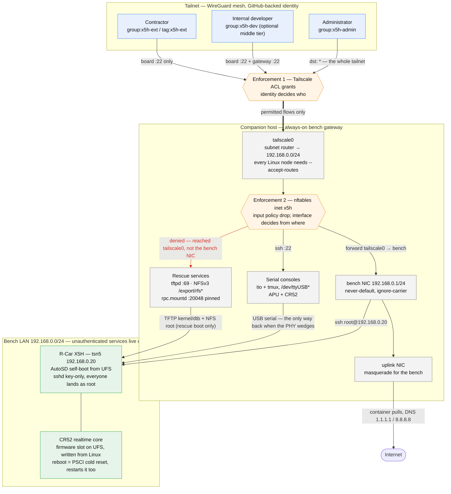
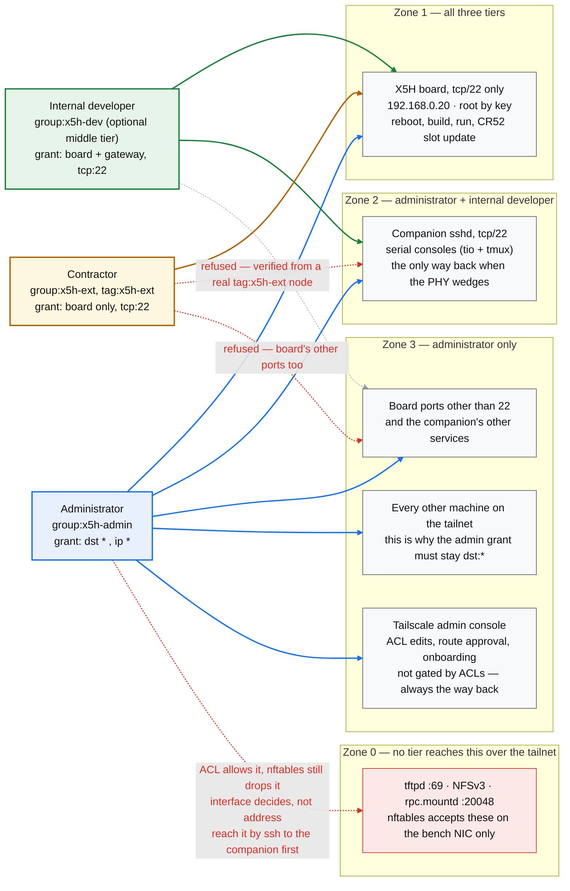

# X5H companion host: always-on bench gateway for remote development

Stands up a small always-on PC next to the X5H that owns the bench LAN,
routes a tailnet into it, and serves the rescue paths (TFTP, NFS) and the
serial consoles. It is what makes the board reachable when nobody is in
the room, and it is where external developers' access is scoped.

> **Status: executed and verified on hardware, 2026-08-10.** The procedure
> below has been run end to end on a companion host, including the reboot
> drill, both netboot rescue paths, and the access-tier tests from a real
> external node. Markers recorded: `COMPANION_REBOOT_PASS`, `ACL_ADMIN_OK`,
> `RESCUE_NETBOOT_YOCTO_PASS`, `RESCUE_NETBOOT_AUTOSD_PASS`,
> `NEGATIVE_ACCESS_PASS`, `REMOTE_REHEARSAL_PASS`. Everything the first draft
> got wrong is corrected in place, and the reasons are kept alongside the
> commands so they do not have to be rediscovered.

## Why a separate machine

The board's bench dependencies used to live on a developer's workstation:
the TFTP server U-Boot pulled kernels from, the NFS export it mounted as
root, and the USB serial adapters. That workstation gets rebooted, taken
home, and put to sleep. [UFS self-boot](selfboot.md) removes the board's
*need* for those services in the normal path, but the rescue paths still
want them, and something has to hold the serial consoles and bridge the
tailnet. That something should be always on and boring.

It also creates the security boundary. The bench LAN carries services with
no authentication worth the name (TFTP has none; NFS here trusts the
subnet). Those must never face the tailnet, because the tailnet is shared
with external developers. The companion is where that separation is
enforced — twice, independently: in the Tailscale ACL, and in a firewall
that scopes each service to an interface.



The serial consoles turn out to matter more than "something has to hold
them" suggests. There is a real failure mode in which the board is booted
and healthy but has no working network, and reports its interface as up
while being unreachable. Serial is then the only way back in. See
[Failure modes](#failure-modes-paid-for-in-hardware).

Assumes Ubuntu 24.04 LTS with two interfaces: `<BIF>` for the bench LAN and
a separate `<uplink>`. Substitute real names throughout. The reference host
used a USB Gigabit adapter for `<BIF>` and Wi-Fi for the uplink; both work,
and both have consequences called out below.

## 1. Base packages and tailnet

```sh
sudo apt update && sudo apt install -y \
  nftables tftpd-hpa nfs-kernel-server tmux tio rsync unattended-upgrades
curl -fsSL https://tailscale.com/install.sh | sh
sudo tailscale set --advertise-routes=192.168.0.0/24
```

Use `tailscale set`, not `tailscale up`: `set` changes the advertised routes
on a node that is already logged in without re-authenticating it. Approve
the route in the admin console (or let `autoApprovers` do it, section 6),
then confirm with `tailscale status --json` that `Self.PrimaryRoutes`
contains `192.168.0.0/24` — that field, not the advertisement, is what says
the tailnet is actually routing through this node.

Tagging the companion is optional and is discussed in section 6, together
with the device-key expiry that will otherwise take the gateway offline on a
schedule.

> **Every Linux node that needs the bench must run
> `sudo tailscale set --accept-routes`.** Accepting advertised subnet routes
> is *off by default on Linux* (it is on by default on macOS and Windows).
> Without it the node never installs `192.168.0.0/24` and sends bench traffic
> to its own default gateway instead, so `ssh root@192.168.0.20` hangs and
> then fails. Nothing in the tailnet or on the companion looks wrong, which
> makes this read as a firewall or ACL problem for as long as you let it.
> Check with `ip route get 192.168.0.20` and require `dev tailscale0` in the
> answer.

If `apt` exits non-zero while every requested package is installed, look for
unrelated half-configured packages (`dpkg -l | grep -v '^ii'`) before
believing the failure is yours; provisioning scripts should test for the
packages they need rather than trusting apt's exit status.

## 2. Bench LAN and forwarding

The companion takes over `192.168.0.1`, the address the board's kernel
command line already uses as its gateway, so nothing on the board changes
when the cables move. `serverip` in the board's saved U-Boot environment is
the same address, so the netboot rescue paths also need no edit.

```sh
sudo nmcli con add type ethernet ifname <BIF> con-name x5h-lan \
  ipv4.method manual ipv4.addresses 192.168.0.1/24 \
  ipv4.never-default yes ipv6.method disabled \
  connection.autoconnect yes
echo 'net.ipv4.ip_forward=1' | sudo tee /etc/sysctl.d/99-x5h.conf
sudo sysctl --system
```

Three things the obvious version of this gets wrong:

- **Autoconnect priority must beat whatever else claims the NIC, and must be
  computed rather than guessed.** NetworkManager auto-creates a profile for
  any wired NIC, and on a carrier event the winner owns the address. If the
  wrong profile wins, the interface ends up with a link-local address and the
  board's U-Boot fails its `tftp` with `ARP Retry count exceeded` — a symptom
  that points nowhere near NetworkManager. Take the highest
  `autoconnect-priority` among the other profiles on that interface and add
  100, so winning is a property of the configuration and not of activation
  history.
- **`ipv4.never-default yes` and `ipv6.method disabled`** keep a bench
  profile from ever competing for the default route.
- **IPv4 forwarding only.** Enabling `net.ipv6.conf.all.forwarding` buys
  nothing here — the advertised route is IPv4 and the board is IPv4-only —
  while enabling per-interface IPv6 forwarding suppresses kernel RA
  processing and is a plausible way to lose the host's own IPv6 default
  route.

Optionally, keep the address even when the board is powered off:

```sh
printf '[device-x5h]\nmatch-device=interface-name:<BIF>\nignore-carrier=yes\n' \
  | sudo tee /etc/NetworkManager/conf.d/50-x5h-ignore-carrier.conf
sudo systemctl reload NetworkManager
```

Without this, losing carrier makes NetworkManager deactivate the profile and
the companion holds no `192.168.0.1` at all while the board is off. Normal
operation does not care (self-boot never uses TFTP, and the firewall matches
on interface name rather than address), but a *cold* netboot rescue becomes a
race: the board's U-Boot starts its transfer a few seconds after power-on,
and NetworkManager has to have finished assigning the address by then. Either
set `ignore-carrier`, or check `ip -br addr show <BIF>` before starting a
rescue.

## 3. Firewall

Identity is the ACL's job; this file's job is to make sure the
unauthenticated bench services can only ever be reached from the bench
LAN, whatever the ACL says. `/etc/nftables.conf`:

```
#!/usr/sbin/nft -f
# Replace only our own table. A global `flush ruleset` destroys the
# iptables-nft tables that Docker installs, on every nftables restart.
table inet x5h
delete table inet x5h

define BIF = "<BIF>"
define UPLINK = "<uplink>"

table inet x5h {
  chain input {
    type filter hook input priority 0; policy drop;
    ct state established,related accept
    iif "lo" accept
    # Containers reaching host services. Also see the forward chain: a drop
    # policy in this table vetoes packets that Docker's own table accepted,
    # because every chain at a hook sees the packet and any drop is final.
    iifname "docker0" accept
    # SSH: tailnet and bench LAN.
    iifname { "tailscale0", $BIF } tcp dport 22 accept
    # If the uplink is a shared LAN you administer this box from, admit SSH
    # from that subnet too -- otherwise the tailnet is the single path to a
    # machine that is supposed to run without a keyboard. Scoped to one
    # RFC1918 subnet on one interface; it is not reachable from the internet.
    iifname $UPLINK ip saddr <uplink-subnet> tcp dport 22 accept
    # TFTP + NFS: bench LAN only -- these face no tailnet, ever.
    # 20048 is rpc.mountd, pinned in section 4. The board's rescue netboot
    # mounts with nfsvers=3, so mountd must be reachable or the mount fails;
    # 69/111/2049 alone is not enough.
    iifname $BIF udp dport { 69, 111, 2049, 20048 } accept
    iifname $BIF tcp dport { 111, 2049, 20048 } accept
    iifname $BIF icmp type echo-request accept
    iifname "tailscale0" icmp type echo-request accept
    udp dport 41641 accept
    # mDNS replies arrive as fresh multicast, not as conntrack-established,
    # so a drop policy silently breaks .local resolution in both directions
    # on a host running avahi. Uplink only.
    iifname $UPLINK udp dport 5353 accept
    iifname $UPLINK icmp type echo-request accept
  }
  chain forward {
    type filter hook forward priority 0; policy drop;
    ct state established,related accept
    iifname "tailscale0" oifname $BIF accept
    iifname $BIF oifname $UPLINK accept
    iifname "docker0" accept
    oifname "docker0" accept
  }
  chain postrouting {
    type nat hook postrouting priority 100;
    iifname $BIF oifname $UPLINK masquerade
  }
}
```

```sh
sudo nft -c -f /etc/nftables.conf && sudo systemctl enable --now nftables
```

The masquerade is what lets the board pull container images; the image
ships static resolvers because nothing on the bench LAN serves DNS.

Note what this ruleset deliberately does *not* do: it does not scope SSH by
destination address, so the companion answers on `22` at its bench address
from the tailnet as well. That is intentional — the address a packet is
addressed to says nothing about where it came from, and the interface it
arrived on does.

Before turning this on, inventory what already listens on the host
(`sudo ss -tulpn`). A default-drop input policy on a machine that was
previously unfirewalled will silently cut remote-desktop tools, printer and
device discovery, and anything else with an inbound listener. Outbound stays
unaffected: there is no output chain, and established/related is accepted, so
tools that connect out to a relay keep working while tools that expect direct
inbound connections stop.

## 4. Rescue services and artifact migration

```sh
sudo mkdir -p /srv/tftp /export/rfs /export/rfs-autosd
sudo tee /etc/default/tftpd-hpa >/dev/null <<'EOF'
TFTP_USERNAME="tftp"
TFTP_DIRECTORY="/srv/tftp"
TFTP_ADDRESS=":69"
TFTP_OPTIONS="--secure"
EOF
sudo mkdir -p /etc/nfs.conf.d
printf '[mountd]\nport = 20048\n' | sudo tee /etc/nfs.conf.d/50-x5h.conf
printf '/export/rfs 192.168.0.0/24(rw,async,no_root_squash,no_subtree_check)\n/export/rfs-autosd 192.168.0.0/24(rw,async,no_root_squash,no_subtree_check)\n' \
  | sudo tee /etc/exports
sudo systemctl enable --now tftpd-hpa nfs-kernel-server && sudo exportfs -ra
```

Why each of those settings is not optional:

- **`--secure`** is what confines tftpd to `TFTP_DIRECTORY`. Upload
  (`--create`) is deliberately off: netboot only reads, and this host is a
  security boundary.
- **`TFTP_ADDRESS` stays `:69`.** Binding to `192.168.0.1:69` would fail at
  boot whenever the board is powered off and the interface has no address,
  which breaks the reboot drill. The firewall is what scopes tftpd to the
  bench LAN.
- **Everything served over TFTP must be mode 644.** tftpd drops to user
  `tftp`, and an unreadable file makes U-Boot's `tftp` fail with an opaque
  timeout rather than a permission error.
- **`rpc.mountd` on a fixed port.** Its default port is random, so without
  pinning it there is nothing to open in the firewall and the `nfsvers=3`
  rescue mount cannot succeed. Verify with
  `rpcinfo -p localhost | awk '$5=="mountd"'`.

Then move the artifacts across. `/srv/tftp` is world-readable, so only the
receiving side needs root:

```sh
sudo rsync -aH --numeric-ids \
  -e 'ssh -i /home/<admin>/.ssh/id_rsa' \
  <user>@<workstation>:/srv/tftp/ /srv/tftp/
```

The `-e` is required: root's `~/.ssh` has no key of its own.

The two NFS roots are different. They are root-owned trees with hundreds of
files an unprivileged user cannot read, so the *sending* side needs root as
well — and rsync cannot answer a remote sudo password prompt, because its
protocol owns the channel that prompt would use. A cached `sudo` credential
does not help either, since `tty_tickets` binds it to the terminal it was
entered on and rsync's remote command has no terminal. Either grant a
narrowly scoped `NOPASSWD` for rsync on the workstation for the duration of
the copy, or stream through a staging file owned by an unprivileged user, one
tree at a time:

```sh
# on the workstation, where sudo can prompt on a real terminal
sudo tar --numeric-owner --xattrs --xattrs-include='*' --acls -S \
  -cf - -C /export/rfs . \
  | ssh <admin>@<companion> 'cat > /home/<admin>/rfs.tar'

# on the companion
sudo tar --numeric-owner --xattrs --xattrs-include='*' --acls \
  -xf /home/<admin>/rfs.tar -C /export/rfs && rm /home/<admin>/rfs.tar
```

**`--xattrs-include='*'` is load-bearing.** GNU tar excludes the `security.*`
namespace from extraction by default, so without it file capabilities and
SELinux labels are dropped silently — the same class of failure that shipped
a rootfs with no kernel modules earlier in this branch. Verify after the
copy, rather than assuming: the file counts on both sides should match
exactly (`find <tree> | wc -l`, run as the *same* kind of user on both), and
`getcap -r <tree>` should return the same set on both. A tree whose source
has no capabilities at all is a valid answer; the point is that the two
agree.

Then the repo and the serial tooling:

```sh
git clone https://github.com/youtalk/openadkit ~/src/openadkit
sudo usermod -aG dialout "$USER"
```

`dialout` only takes effect in new login sessions, so `/dev/ttyUSB*` stays
unreadable until you log in again — or until the reboot drill below. The
console helper scripts derive their log directory from their own location, so
they work from any checkout path.

Vendor SDK material stays off this list unless the companion is
administrator-only; it must not become reachable from a shared tailnet. None
of the four objectives needs it.

Verify: `showmount -e localhost` lists both exports, and `ss -uln | grep :69`
shows tftpd listening.

## 5. Host hardening and unattended updates

```sh
# put the admin pubkey in ~/.ssh/authorized_keys and verify a key login FIRST
printf 'PasswordAuthentication no\nPermitRootLogin no\n' \
  | sudo tee /etc/ssh/sshd_config.d/50-x5h.conf
sudo mkdir -p /run/sshd && sudo sshd -t
sudo systemctl is-active --quiet ssh.service && sudo systemctl reload ssh.service
sudo sshd -T | grep -x 'passwordauthentication no'
sudo dpkg-reconfigure -f noninteractive unattended-upgrades
```

Ubuntu 24.04 activates sshd through `ssh.socket`, so `ssh.service` is
inactive and **`systemctl reload ssh` has nothing to reload** — each
connection spawns a fresh sshd that reads the config anyway. Socket
activation also means the privilege separation directory only exists for the
lifetime of a connection, so a bare `sshd -t` fails with
`Missing privilege separation directory: /run/sshd`; create it first. And
because a command failing before the final `&&` of a list is exempt from
`set -e`, the tempting `sshd -t && systemctl reload ssh` will skip the reload
and let a provisioning script report success either way. Assert the live
state with `sshd -T` instead of assuming the file you wrote took effect.

If the companion is a laptop, stop the lid from suspending the bench:

```sh
printf '[Login]\nHandleLidSwitch=ignore\nHandleLidSwitchDocked=ignore\nHandleLidSwitchExternalPower=ignore\n' \
  | sudo tee /etc/systemd/logind.conf.d/50-x5h-nosuspend.conf
```

Applied at next boot. Check the idle-suspend setting of the desktop session
too; a suspended gateway takes the board, TFTP, NFS and the tailnet route
down with it.

## 6. Access tiers

Administrators get the whole bench. External developers get the board's
SSH port and nothing else — not the companion, not TFTP, not NFS.



Zone 0 is the one worth staring at: **not even the administrator's `dst: *`
reaches TFTP, NFS or mountd over the tailnet**, because the firewall matches
on the interface a packet arrived on rather than on its address. The
administrator gets at those services by opening an SSH session to the
companion first. That is what makes a mistake in the ACL survivable.

The middle tier is optional. Two tiers are enough if everyone who is not
external is an administrator; add `group:x5h-dev` when someone needs the
serial consoles — which is to say, needs to recover a board whose network
has wedged — without getting the rest of the tailnet. The bench services
stay out of reach at either setting, since Zone 0 is enforced by the
firewall and not by identity.

Read the current policy before writing anything. **The policy file replaces
the tailnet's defaults rather than adding to them**, so a merge that only
adds the x5h rules removes the default "allow all your own devices" grant
along the way. Match the syntax already in the file: newer tailnets use
`grants`, older ones `acls`, and mixing them is avoidable work.

```jsonc
{
  "groups": {
    // An identity is however its issuer spells it. Users who sign in through
    // the tailnet's own provider are named as that provider names them: a
    // GitHub-backed tailnet uses GitHub logins, not e-mail addresses, and an
    // address that does not exist here yields an empty group and an admin
    // rule that grants nothing. Invited external users are the exception --
    // they pick their own provider, so their identity is usually an e-mail
    // address and need not have the same shape as the admin's.
    "group:x5h-admin": ["<admin-login>"],
    "group:x5h-ext":   [],   // invited external identities land here
    // Optional middle tier: internal developers who need the board and the
    // gateway's serial consoles, but not the rest of the tailnet. Omit the
    // group and its grant below if two tiers are enough.
    "group:x5h-dev":   [],
  },
  "tagOwners": {
    "tag:x5h-gw":  ["autogroup:admin"],
    "tag:x5h-ext": ["autogroup:admin"],
  },
  "grants": [
    // Administrators keep unrestricted access. Do not narrow this to the
    // gateway and the bench subnet: with the default allow-all grant removed,
    // that is what cuts you off from every other machine on your own tailnet.
    {"src": ["group:x5h-admin"], "dst": ["*"], "ip": ["*"]},
    // Optional internal tier: the board plus the gateway's SSH, so they can
    // drive the serial consoles. Name the gateway by its tag; if it is not
    // tagged, use its node name instead.
    {"src": ["group:x5h-dev"], "dst": ["192.168.0.20", "tag:x5h-gw"], "ip": ["tcp:22"]},
    // External tier. In grants syntax the port restriction lives in "ip",
    // not appended to "dst".
    {"src": ["group:x5h-ext", "tag:x5h-ext"], "dst": ["192.168.0.20"], "ip": ["tcp:22"]},
  ],
  "autoApprovers": {
    "routes": {"192.168.0.0/24": ["tag:x5h-gw", "group:x5h-admin"]},
  },
}
```

Keep the admin console open after saving and confirm you can still reach your
own machines before considering it done. ACLs do not gate console access, so
the console is always the way back.

The board's own sshd is key-only (`PasswordAuthentication no`,
`PermitRootLogin prohibit-password`), so the well-known development root
password is not a network credential. It still works on the serial
console, which is deliberate — that is the recovery path.

### Device key expiry on the gateway

A user-owned node's device key expires (180 days by default). When it does,
the subnet router stops routing and someone has to re-authenticate
interactively — a scheduled outage for an unattended gateway. Check it with
`tailscale status --json` (`Self.KeyExpiry`) and pick one:

- **Disable key expiry** for the device in the admin console. Least
  invasive, and enough on its own.
- **Tag it** `tag:x5h-gw`. Tagged devices have no key expiry and let
  `autoApprovers` re-approve the route by itself, at the cost of
  re-authentication and of no longer matching user-based rules. The admin
  grant above is `dst: ["*"]`, so tagging can be decided independently and
  later.

### Onboarding an external developer

External developers join as **users of this tailnet**, by invitation. Do not
share the gateway node with them instead: **a shared node does not carry its
subnet routes.** The control plane rewrites the ACLs of an externally shared
subnet router so the recipient reaches that node and nothing behind it, and
the board is on the far side of the advertised `192.168.0.0/24` — so a share
leaves the board unreachable, with nothing to correct at either end.

1. Settle it with their employer first. A tailnet by default lets only its
   own Admins accept an invitation to an *external* tailnet, so a developer
   whose company runs Tailscale cannot accept until their IT administrator
   permits it. Discovering this after the invite is issued costs a round
   trip and presents as a fault at this end.
2. Invite them from the admin console — Users, then *Invite external users*
   — by e-mail or by link. Invites are one-time and expire after 30 days.
   Each user who accepts counts against the tailnet's plan: a hard cap on
   the free tier, and a per-user charge on the paid ones, where there is no
   user limit to plan around.
3. Once they have accepted, read their identity off the Users page and add
   that string to `group:x5h-ext` exactly as shown. They authenticate with
   whichever provider they choose — any supported IdP, or a passkey — so
   what belongs in the group is **not knowable before they accept**, and is
   usually an e-mail address rather than a login of this tailnet's own
   provider.
4. Append their public key to `/etc/ssh/authorized_keys.d/root` on the
   board — or to `config/x5h-authorized-keys` if it should survive an
   image rebuild.
5. Verify with the checks below, from their node.

Steps 3 and 4 are independent, and each is silent when omitted: without the
grant their SSH hangs, without the key it is refused. Doing one and calling
it done is the usual result of splitting them across a day.

Offboarding is the reverse; remember the key on the board outlives the
tailnet removal.

## 7. Verification

### Reboot drill

Set the BIOS to power on after AC loss, then `sudo reboot` and check from
elsewhere on the tailnet:

```sh
ssh <companion> 'tailscale status | head -3 \
  && ip -4 addr show <BIF> | grep -q 192.168.0.1 \
  && showmount -e localhost \
  && ss -uln | grep -q ":69 " \
  && systemctl is-active nftables tftpd-hpa nfs-kernel-server' \
  && echo COMPANION_REBOOT_PASS
```

Use `grep -q`, not `sed -n /:69/p`: `sed` exits 0 whether or not it matched,
so as a link in an `&&` chain it can never fail and the check silently proves
nothing.

### Access tiers

From an admin node:

```sh
tailscale ping <companion> && ssh <companion> true && ssh root@192.168.0.20 true \
  && echo ACL_ADMIN_OK
```

If the admin key has a passphrase, run this with the key loaded into an
agent. Without one, ssh cannot produce a signature and reports
`Permission denied (publickey)` — while the server-side log and `ssh -vv`
both show `Server accepts key`. The failure is local; the key is fine.

From a node joined with a `tag:x5h-ext` auth key, using a key authorised on
the board. Confirm the node is really tag-owned before believing any of it:

```sh
tailscale status --json | grep -A2 '"Tags"'   # must list tag:x5h-ext
```

A node that joined user-owned matches `group:x5h-admin`, is granted
`dst: ["*"]`, and will therefore reach *everything* — which reads as a broken
ACL rather than a broken test. Tags come from the auth key, so the key has to
be created with the tag selected; alternatively a tag owner can self-assign
it with `tailscale up --advertise-tags=tag:x5h-ext --force-reauth`. Use one
mechanism or the other, not both.

Then probe, from that node:

| destination | expected | what it isolates |
|---|---|---|
| `192.168.0.20:22` | reachable | the tier still does its job; positive control |
| `192.168.0.20:2049` | blocked | the ACL restricts the *port*, not just the host |
| `<companion tailnet IP>:22` | blocked | the ACL alone — nftables admits tcp/22 on `tailscale0` |
| `192.168.0.1:2049` | blocked | both layers at once |

Both layers **drop** rather than reject, so a blocked probe does not fail
fast — it hangs until whatever timeout you imposed. With
`timeout 6 tailscale nc <host> <port> </dev/null`, exit 0 means the
connection was established and closed on our EOF, and exit 124 means the
handshake never completed. Getting that mapping backwards turns a working
boundary into a reported failure, so assert that the permitted destination
and a blocked one land on *different* exit statuses before reporting a
verdict at all. Note also that a bare "no bytes received" is not evidence of
blocking: NFS sends no banner on connect. For the positive control, hold
stdin open and read the SSH banner as payload proof.

UDP 69 is not worth probing directly: a UDP connect test cannot distinguish
"filtered" from "no reply". It sits in the same nftables rule and the same
interface scope as udp/2049, so the NFS result covers it by construction.

### Netboot rescue through the companion

One-shot boots from the U-Boot prompt; neither writes the environment, so
the board returns to UFS self-boot on the next reset with nothing to undo.
`printenv` first, as always.

```
=> printenv bootcmd bootcmd_yocto bootcmd_autosd
=> ping 192.168.0.1            # host is alive -> the bench path works
=> run bootcmd_yocto           # TFTP kernel+dtb, NFS root /export/rfs
=> run bootcmd_autosd          # TFTP kernel+dtb, NFS root /export/rfs-autosd
```

Confirm on the booted system that the root really is the companion's export,
rather than trusting that the command ran:

```sh
findmnt -n -o SOURCE,FSTYPE /                    # 192.168.0.1:/export/... nfs
findmnt -n -o OPTIONS / | tr ',' '\n' | grep -E 'vers|mount'
```

The second command is the one that proves the mountd rule earns its place:
`mountvers=3` and `mountproto=tcp` mean the client talked to `rpc.mountd`
over TCP, which the original 69/111/2049 ruleset would have dropped.

Two expected results that are not faults: the netbooted AutoSD root is the
pre-self-boot image and has **no sshd**, so verify it over serial; and
podman logs overlayfs complaints there because its store cannot sit on NFS,
which is exactly why self-boot uses a btrfs partition instead.

### Remote workday rehearsal

From off-bench, over the tailnet only: smoke, remote reset, wait, smoke.

```sh
ssh root@192.168.0.20 sh /usr/local/bin/selfboot-smoke.sh   # boot A
ssh root@192.168.0.20 reboot
# wait for it to answer again, then
ssh root@192.168.0.20 sh /usr/local/bin/selfboot-smoke.sh   # boot B
```

**`selfboot-smoke.sh` passes once per boot.** The CR52 announces its RPMsg
endpoint exactly once per SoC reset, so a second run in the same boot fails
on `service_timeout` no matter how long it waits — a failure that looks like
a regression in whatever you last changed. Budget one smoke per boot and put
a reset between the tiers you verify. `rpmsg-smoke.sh --check` is read-only
and can be run as often as you like; `dmesg | grep -c 'creating channel'`
returning 0 says the current boot's session is still unused.

Comparing `/proc/sys/kernel/random/boot_id` either side of the reset is a
cheap way to prove the board actually reset rather than merely stayed up.

## Failure modes paid for in hardware

**The bench link can come up unusable after returning from a netboot
rescue.** Symptom: the board boots fine from UFS and the console is healthy,
but the Ethernet switch driver logs a register-wait timeout, the PHY fails
master/slave resolution, and the PHY state machine halts with a WARNING
backtrace. The trap is that **the board then reports its interface as `UP`
with `LOWER_UP` and its address assigned** while being completely
unreachable, because the driver reports carrier optimistically. Nothing on
the board looks wrong from the board.

Another `reboot` clears it. Since the network is what is broken, that reboot
has to be issued over serial — which is the concrete reason the companion
holds the consoles rather than merely being near the board.

**Do not treat a timeout as a dead board.** A good reset answers again in
about 30 seconds; a link that fails to negotiate can leave the board silent
for minutes and then recover on its own. Polling for 155 seconds and
concluding failure has already produced one wrong diagnosis. Look at the
serial console before deciding.

**The board's `tsn5` MAC address is randomised on every boot.** Anything
built on a stable MAC — DHCP reservations, MAC filtering, static ARP entries
— will not work.

**The board has no RTC or NTP on the bench LAN**, so its log timestamps are
wrong by days. Correlate against the companion's clock, not the board's.

## Related

- [UFS self-boot](selfboot.md) — why the board no longer depends on this
  host, and the rescue commands that still do.
- [CR52 slot update](cr52-slot-update.md) — the remote firmware workflow
  this host makes reachable.
